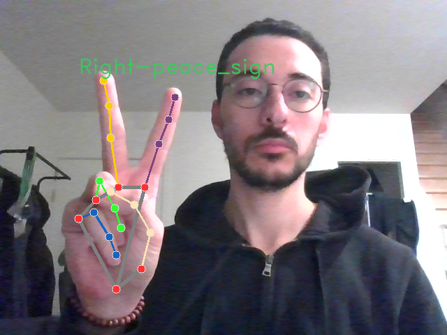
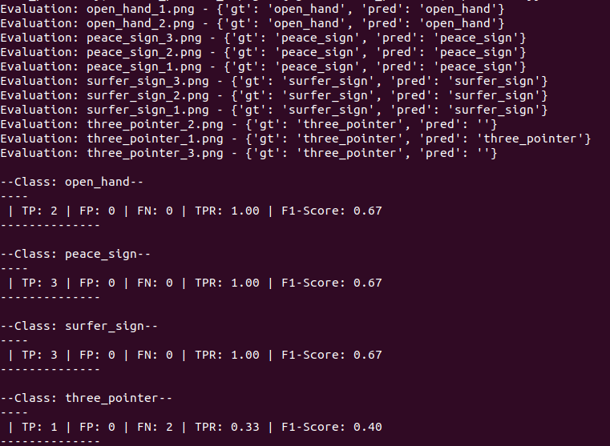

# Hand Sign Recognition
This project is my implementation of a Hand Sign Recognition system as part of my application for a role within Sopra Steria.

## Assignment:
  In this assessment, the goal is to detect different signs using a live camera feed (webcam). It is encouraged to use the library Mediapipe[] from google which provides a built-in object detection functionalities for wrist, knuckles and fingers.

  The task requirement are:

- [x] Set up GitHub repository to host the application with a code structure, documentation and a README file
- [x] Implement a Hand Sign Recognition algorithm
- [X] Detect Three Hand Signs: Open Hand, Peace Sign, Surfer Sign
- [X] Run live on a camera stream and visualize results on screen
- [X] Benchmark a hand sign detection model on a dataset of 10 images

  Additionally, bonus points are assigned if:

- [X] I define and Recognize a 4th Hand Sign
- [ ] Recognize Hand Waving Gesture
- [X] Create API endpoint for /predict

## Hand Landmarks & Sign Recognition


### Hand Landmarks

The [MediaPipe Hand Landmarker](https://ai.google.dev/edge/mediapipe/solutions/vision/hand_landmarker) from Google AI allows detecting hand landmarks, i.e keypoints, to facilitate downstream tasks like hand signs or hand gesture recognition which can later act as a base for sophisticated application in AR, VR, Robotics, etc.

The hand landmark detects the keypoint localization of 21 hand-knuckle coordinates per detected hand as seen below.


### Hand Sign Recognition

Knowing how the hand landmarks are structure from the *hand_landmarker* detector object, we defined our algorithm so that it takes as input the hand_landmarks, and for each finger in **[Thumb, Index, Middle, Ring, Pinky]** determine if it's extended or folded by comparing the x-wise distance between the MCP(1) and the TIP in case of the thumb and the euclidean distance between Finge_PIP(x,y) and Finger_TIP(x,y)

and we define Hand Signs as 

```
HAND_SIGNS = {
    "open_hand": [True, True, True, True, True],
    "peace_sign": [False, True, True, False, False],
    "surfer_sign": [True, False, False, False, True],
    "three_pointer": [False, False, True, True, True]
}
```


## How to test it out

### Getting Started
First clone this repo and install the required packages

```
  # Preferably use a virtual environment or a Conda environment
  git clone https://github.com/kais-bedioui/hand-gesture-recognition.git
  cd hand-gesture-recognition
  pip install -r requirement.txt
```
**PS**: For a quick introduction, I provided in `data/` the hand landmarks model file from *mediapipe* as well as the test set

### Live Demo
You can test it out with your webcam by running

`PYTHONPATH=src python3 src/live_demo.py`

Where you should see the live output of the webcam. The rendering contains all 21 Landmarks drawn in their correct place, 'Right' or 'Left', referred to as *Handedness*, and the hand sign coming from this Algorithm.




### Benchmarking
Simply run

`PYTHONPATH=src/ python3 src/benchmarker.py`

You should see this report on the terminal at the end:



And saved images with the prediction rendered on it, next to each input image.

### Inference server
Open two terminals. In the first one run:

`PYTHONPATH=src python3 src/flask_app.py`

And then launch the client by running:

`python3 src/flask_client.py #modify image_path variable to try a different image`
